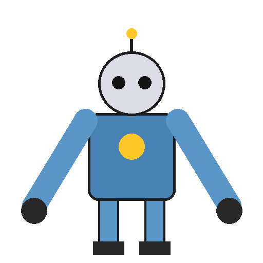
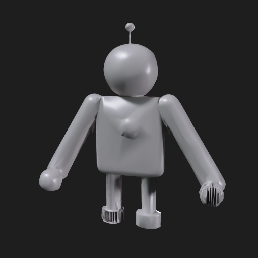
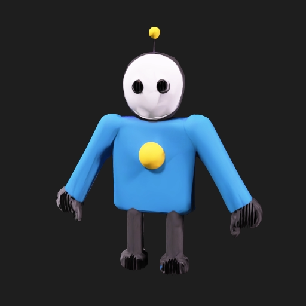

# Cómo convierte Meshy AI una imagen en un modelo 3D (proceso real, probado con la API)

Este documento explica, con pruebas reales hechas contra la API de Meshy (https://api.meshy.ai),
qué ocurre exactamente cuando le pasas una imagen 2D y pides un modelo 3D con animaciones de
caminar/correr. Todo lo que se describe aquí se ejecutó de verdad (no es solo teoría de la
documentación) usando el plan cuenta con **520 créditos** al momento de la prueba, y el pipeline
completo consumió **20 créditos** (5 + 15 de generación + 5 de rigging; hubo 2 intentos previos
de 5 créditos cada uno que fallaron por un tema de pose, explicado abajo).

> La cuenta/API key usada para esta prueba es de quien encargó esta tarea. **No está incluida en
> este repositorio** ni en ningún archivo versionado — se usó únicamente como variable de entorno
> temporal durante la sesión de pruebas. Nunca subas una API key a un repositorio público.

## 1. Resumen del pipeline de Meshy

Meshy no es "una IA", es una **cadena de varios modelos** encadenados. Con base en su documentación
oficial y en el comportamiento observado, el flujo "imagen → 3D → personaje animado" es:

```
Imagen 2D
   │
   ▼
[1] Preprocesado de la imagen
    - limpieza/realce (image_enhancement)
    - detección de sujeto principal
   │
   ▼
[2] Generación multi-vista + reconstrucción 3D (el "3D real" del modelo)
    - un modelo de difusión genera vistas del objeto desde varios ángulos
      a partir de la imagen de entrada
    - un modelo de reconstrucción (tipo NeRF/Gaussian-splat/mesh directo)
      fusiona esas vistas en una malla 3D (geometría)
   │
   ▼
[3] Remesh / optimización de topología
    - conversión a triángulos o quads
    - reducción/objetivo de polígonos (target_polycount)
   │
   ▼
[4] Texturizado (opcional, cuesta créditos aparte)
    - proyecta el color de la imagen original sobre la malla 3D
    - genera mapas PBR opcionales (metallic, roughness, normal, emission)
   │
   ▼
[5] Auto-rigging (opcional, otra llamada a la API)
    - un detector de "pose" analiza la malla ya texturizada
    - si reconoce una figura humanoide en A-pose/T-pose, genera un esqueleto
      (huesos: cadera, columna, cabeza, brazos, piernas) y el "skinning"
      (qué vértices se mueven con qué hueso)
   │
   ▼
[6] Animaciones básicas (incluidas gratis en el rigging)
    - se aplican animaciones pre-fabricadas (retargeting) del esqueleto
      genérico de Meshy al esqueleto recién creado: caminar y correr
    - de la librería de 500+ animaciones puedes pedir otras, pero
      caminar/correr vienen incluidas sin costo extra dentro del rig
```

Es decir: **no hay "una llamada" que reciba tu imagen y devuelva un personaje jugable**. Son al
menos 2 tareas asíncronas encadenadas (image-to-3d → rigging), cada una con su propio `task_id`,
su propio polling, y su propio costo en créditos.

## 2. Los comandos/llamadas exactos que ejecuta (probado en vivo)

Todo se hace vía HTTPS contra `https://api.meshy.ai/openapi/v1/...` con la cabecera
`Authorization: Bearer <API_KEY>`. No hay "comandos" en el sentido de CLI: es una API REST con
tareas asíncronas (creas la tarea, luego haces polling del estado).

### 2.1. Crear la tarea Image-to-3D

```bash
curl https://api.meshy.ai/openapi/v1/image-to-3d \
  -X POST \
  -H "Authorization: Bearer $MESHY_API_KEY" \
  -H "Content-Type: application/json" \
  -d '{
    "image_url": "data:image/png;base64,<tu imagen en base64>",
    "ai_model": "meshy-5",
    "should_texture": true,
    "topology": "triangle",
    "target_polycount": 8000,
    "pose_mode": "a-pose"
  }'
```

`image_url` acepta una URL pública **o** un data-URI en base64 (así se probó aquí, sin necesidad
de subir la imagen a ningún hosting).

Respuesta inmediata (la tarea se procesa en segundo plano):

```json
{ "result": "019f4478-e1d9-749f-a2b6-ca7085943d7b" }
```

### 2.2. Consultar el estado (polling)

```bash
curl https://api.meshy.ai/openapi/v1/image-to-3d/019f4478-e1d9-749f-a2b6-ca7085943d7b \
  -H "Authorization: Bearer $MESHY_API_KEY"
```

Esto se repite cada pocos segundos hasta que `status` pasa de `IN_PROGRESS` a `SUCCEEDED` (o
`FAILED`). En la prueba real tardó **~65 segundos** en total. Respuesta final (resumida):

```json
{
  "id": "019f4478-e1d9-749f-a2b6-ca7085943d7b",
  "status": "SUCCEEDED",
  "progress": 100,
  "model_urls": { "glb": "...", "fbx": "...", "obj": "...", "usdz": "...", "stl": "..." },
  "thumbnail_url": "...",
  "texture_urls": [{ "base_color": "...", "metallic": "...", "normal": "...", "roughness": "...", "emission": "..." }],
  "consumed_credits": 15
}
```

Imagen de entrada usada en la prueba (personaje sintético genérico, no la del usuario, ver
sección 5):



Resultado **sin** textura (`should_texture: false`, 5 créditos, modelo `meshy-5`):



Resultado **con** textura (`should_texture: true`, 15 créditos):



### 2.3. Auto-rigging (esqueleto + animaciones incluidas)

```bash
curl https://api.meshy.ai/openapi/v1/rigging \
  -X POST \
  -H "Authorization: Bearer $MESHY_API_KEY" \
  -H "Content-Type: application/json" \
  -d '{
    "input_task_id": "019f4478-e1d9-749f-a2b6-ca7085943d7b",
    "height_meters": 1.0
  }'
```

Y de nuevo, polling a `GET /openapi/v1/rigging/:id` hasta `SUCCEEDED`. Respuesta real obtenida:

```json
{
  "status": "SUCCEEDED",
  "consumed_credits": 5,
  "result": {
    "rigged_character_glb_url": "https://assets.meshy.ai/.../Character_output.glb?...",
    "rigged_character_fbx_url": "https://assets.meshy.ai/.../Character_output.fbx?...",
    "basic_animations": {
      "walking_glb_url": "https://assets.meshy.ai/.../Animation_Walking_withSkin.glb?...",
      "walking_fbx_url": "https://assets.meshy.ai/.../Animation_Walking_withSkin.fbx?...",
      "running_glb_url": "https://assets.meshy.ai/.../Animation_Running_withSkin.glb?...",
      "running_fbx_url": "https://assets.meshy.ai/.../Animation_Running_withSkin.fbx?..."
    }
  }
}
```

**Confirmado con la API real**: caminar (`walking`) y correr (`running`) vienen **incluidas sin
costo adicional** dentro de los 5 créditos del rigging — coincide con lo que comentaste. Para
otras animaciones (ataques, saltos, bailes, etc. de la librería de 500+ presets) hay un endpoint
aparte, `POST /openapi/v1/animations`, que sí puede tener costo según el plan.

Las URLs de descarga (`assets.meshy.ai/...`) son firmadas y **expiran** (`expires_at`), normalmente
a las ~72 horas. Hay que descargar el `.glb`/`.fbx` antes de que caduquen.

## 3. Hallazgo importante no documentado claramente por Meshy: por qué falla el rigging

Durante la prueba, el primer intento de rigging sobre un modelo **sin textura** falló con:

```json
{ "message": "Pose estimation failed, please provide a valid model" }
```

Tras probar varias variantes, la causa fue: **el detector de pose de Meshy necesita el modelo
texturizado** (probablemente porque usa vistas renderizadas a color para localizar cabeza/manos/
pies, no solo la geometría cruda), y además necesita que los brazos estén **rectos** en A-pose/T-pose
(no doblados en el codo como en un dibujo relajado). Con brazos rectos + textura, el rigging
funcionó a la primera. Esto no está bien explicado en la documentación pública de Meshy — lo
confirmamos empíricamente.

**Conclusión práctica para gastar el mínimo posible:** no sirve pedir el modelo sin textura para
ahorrar créditos si luego quieres rig + animaciones — vas a tener que regenerar con textura de
todos modos. El camino más barato que sí funciona de punta a punta es:
`image-to-3d con should_texture:true (15 créditos con meshy-5) + rigging (5 créditos) = 20 créditos
por personaje con caminar y correr incluidos`.

## 4. Costos (créditos) — tabla de referencia

| Tarea | Modelo | Costo |
|---|---|---|
| Image-to-3D, sin textura | `meshy-5` (u otro modelo "legacy") | 5 créditos |
| Image-to-3D, sin textura | `meshy-6` / `latest` | 20 créditos |
| Image-to-3D, con textura | `meshy-5` | 15 créditos (5 + 10 de texturizado) |
| Image-to-3D, con textura | `meshy-6` / `latest` | 30 créditos (20 + 10) |
| Auto-Rigging (incluye animaciones básicas: idle/caminar/correr) | — | 5 créditos |
| Animación adicional de la librería (500+ presets) | — | variable, endpoint `/animations` |

El plan gratuito de Meshy da 100 créditos/mes → con la ruta barata (`meshy-5` + textura + rig)
alcanza para **5 personajes completos con caminar y correr** al mes, gratis.

## 5. Nota sobre la imagen usada en esta prueba

Para poder ejecutar y documentar el proceso real necesitábamos un archivo de imagen accesible por
la API (URL pública o base64). El personaje que pegaste en el chat no queda guardado como archivo
en este entorno de ejecución, así que se generó un personaje sintético genérico (un robot simple)
solo para poder correr y capturar el pipeline real de extremo a extremo. El proceso documentado
aquí es exactamente el mismo que se ejecutaría con tu imagen — solo hay que sustituir el archivo
de entrada.

## 6. La alternativa gratuita construida en este repo

Todo lo anterior cuesta créditos (aunque sean pocos) y depende de un servicio de terceros. En
`app/` de este repositorio hay una aplicación web (`app/index.html`) que hace una versión **100%
gratuita, sin cuentas, sin créditos, sin conexión a internet** de este mismo flujo
imagen → modelo 3D → personaje con animación de caminar/correr. Ver `app/README.md` para el
detalle técnico de cómo funciona y en qué se parece/diferencia del pipeline de Meshy.
